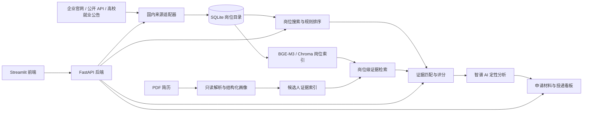

# AI Job Apply Assistant

[](https://www.python.org/)
[](https://fastapi.tiangolo.com/)
[](#测试与验证)
[](LICENSE)

一个方便应聘者使用的 Agent 求职辅助系统，整合岗位发现、简历匹配、申请材料生成和投递记录管理，形成可追踪的求职工作流。

## 核心能力

- 岗位聚合：统一接入企业招聘官网、公开招聘接口和高校就业公告等合规公开来源。
- 一键更新：前端点击一次即可执行“岗位同步 → 去重入库 → 岗位索引重建”，无需常驻自动任务。
- PDF 简历解析：抽取结构化画像并构建候选人证据索引。
- 可解释岗位匹配：结合硬性条件、技能覆盖、项目证据和风险项给出分项评分及引用依据。
- 岗位级 RAG：使用 BGE-M3 与 Chroma 检索候选人证据和岗位证据。
- Agent 工具调用：通过 LangChain 编排岗位搜索、匹配分析和申请材料生成工具。

## 系统架构



前端“一键更新”的执行链路为：

```text
点击更新 → 拉取已启用来源 → 标准化与去重 → 写入 SQLite → 重建岗位索引 → 返回同步统计
```

## 技术栈

| 层次 | 主要技术 |
|---|---|
| 前端 | Streamlit |
| API | FastAPI、Pydantic |
| LLM 与编排 | 智谱 AI、LangChain |
| 检索 | BGE-M3、Chroma |
| 数据 | SQLite、CSV、JSON |
| 测试与部署 | Pytest、Docker Compose |

## 检索指标

下表来自岗位级数据集评测，配置为 BGE-M3：

| 指标 | 结果 |
|---|---:|
| MRR@3 | 0.7614 |
| HitRate@1 | 0.6696 |
| Recall@3 | 0.7411 |
| Recall@5 | 0.8750 |

## 快速开始

### 1. 创建环境并安装依赖

Linux / macOS：

```bash
python3.10 -m venv .venv
source .venv/bin/activate
python -m pip install --upgrade pip
python -m pip install -r requirements.txt -r requirements-dev.txt
```

Windows PowerShell：

```powershell
python -m venv .venv
.\.venv\Scripts\Activate.ps1
python -m pip install --upgrade pip
python -m pip install -r requirements.txt -r requirements-dev.txt
```

### 2. 配置环境变量

Linux / macOS：

```bash
cp .env.example .env
```

Windows PowerShell：

```powershell
Copy-Item .env.example .env
```

离线演示无需 API Key，保留以下安全配置即可：

```dotenv
ZAI_API_KEY=
EMBEDDING_BACKEND=hash
ENABLE_RERANKER=false
DOMESTIC_SYNC_ENABLED=false
```

需要大模型分析时，在本机 `.env` 中填写 API Key。
需要 BGE-M3 时，将嵌入后端改为 Hugging Face，并按机器条件配置本地模型目录或模型名称。

实际使用时可以直接启动服务，在前端设置当前 `candidate_id`、毕业年份、目标岗位和目标城市，上传自己的可提取文本 PDF 简历，然后点击“一键更新岗位”。个人简历、模型密钥、投递记录和本地索引均不会进入版本库。

### 3. 启动服务

终端 1：

```bash
python -m uvicorn app.main:app --host 0.0.0.0 --port 8000
```

终端 2：

```bash
python -m streamlit run streamlit_app.py --server.port 8501
```

浏览器访问 `http://127.0.0.1:8501`。API 文档位于 `http://127.0.0.1:8000/docs`。

## Docker Compose

```bash
cp .env.example .env
docker compose up --build
```

Windows PowerShell 将第一行替换为：

```powershell
Copy-Item .env.example .env
```

启动后访问前端 `http://127.0.0.1:8501`。停止服务：

```bash
docker compose down
```

## 岗位来源

优先使用企业招聘官网、明确公开的 JSON 接口和高校就业公告。

来源适配器支持独立启停、频率控制、失败隔离和字段标准化。公开页面结构变化时，对应适配器可能需要维护。

## 测试与验证

```bash
python -m pytest -q
python -m tools.evaluate_retrieval_v2
```

## 项目局限

- 岗位来源受公开页面稳定性和网站使用条款影响，无法保证覆盖全部公司或持续实时更新。
- 规则评分和 LLM 输出只能作为求职决策辅助，不能替代人工判断。
- Agent 与知识问答会话已支持最近窗口、滚动摘要、输入预算和工具结果引用；尚未实现跨会话长期记忆。

## 项目结构

```text
app/                    FastAPI、领域逻辑与来源适配器
streamlit_app.py         Streamlit 前端
data/demo/              完全合成的示例数据
data/eval_dataset/      可复现实验数据与报告
docs/                   架构、截图和说明
tests/                  自动化测试
tools/                  数据导入、评测和示例生成工具
compose.yaml            本地容器编排
```

## 许可证

本项目采用 [MIT License](LICENSE)。
