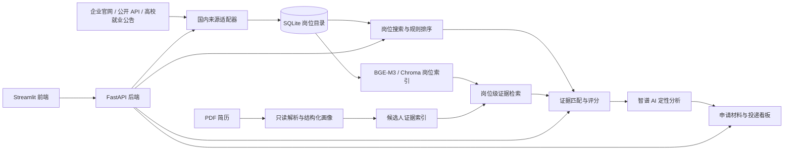

# AI Job Apply Assistant

[](https://www.python.org/)
[](https://fastapi.tiangolo.com/)
[](#测试与验证)
[](LICENSE)

一个面向国内秋招的求职辅助系统，整合岗位发现、简历匹配、申请材料生成和投递记录管理，形成可追踪的求职工作流。

## 核心能力

- 岗位聚合：统一接入企业招聘官网、公开招聘接口和高校就业公告等合规公开来源。
- 一键更新：前端点击一次即可执行“岗位同步 → 去重入库 → 岗位索引重建”，无需常驻自动任务。
- PDF 简历解析：抽取结构化画像并构建候选人证据索引。
- 可解释岗位匹配：结合硬性条件、技能覆盖、项目证据和风险项给出分项评分及引用依据。
- 岗位级 RAG：使用 BGE-M3 与 Chroma 检索候选人证据和岗位证据。
- Agent 工具调用：通过 LangChain 编排岗位搜索、匹配分析和申请材料生成工具。
- 多轮 Agent 会话：显式 `conversation_id` 启用最近消息、滚动结构化摘要和任务状态记忆，并按候选人、岗位隔离。
- 上下文预算：模型调用前统计 Token，按优先级裁剪历史、JD 和简历，并为输出与工具结果预留空间。
- 工具结果引用：原始工具结果在存储上限内写入会话数据库，模型仅接收摘要和 `tool_result_ref`。
- RAG 服务端会话：知识问答可复用同一会话窗口与滚动摘要，无需前端回传完整历史。
- 投递管理：记录岗位状态、分析结果和生成材料。

## 系统架构



前端“一键更新”的执行链路为：

```text
点击更新 → 拉取已启用来源 → 标准化与去重 → 写入 SQLite → 重建岗位索引 → 返回同步统计
```

## 技术栈

| 层次 | 主要技术 |
|---|---|
| 前端 | Streamlit |
| API | FastAPI、Pydantic |
| LLM 与编排 | 智谱 AI、LangChain |
| 检索 | BGE-M3、Chroma；支持 Hash 嵌入离线演示 |
| 数据 | SQLite、CSV、JSON |
| 测试与部署 | Pytest、Docker Compose |

## 检索指标

下表来自岗位级数据集评测，配置为 BGE-M3：

| 指标 | 结果 |
|---|---:|
| MRR@3 | 0.7614 |
| HitRate@1 | 0.6696 |
| Recall@3 | 0.7411 |
| Recall@5 | 0.8750 |
| nDCG@5 | 0.7488 |
| P95 检索延迟 | 21.21 ms |

这些指标只衡量当前离线数据集上的证据检索质量，不代表整体岗位匹配准确率、录用概率或线上全量市场表现。
## 快速开始

### 1. 创建环境并安装依赖

Linux / macOS：

```bash
python3.10 -m venv .venv
source .venv/bin/activate
python -m pip install --upgrade pip
python -m pip install -r requirements.txt -r requirements-dev.txt
```

Windows PowerShell：

```powershell
python -m venv .venv
.\.venv\Scripts\Activate.ps1
python -m pip install --upgrade pip
python -m pip install -r requirements.txt -r requirements-dev.txt
```

### 2. 配置环境变量

Linux / macOS：

```bash
cp .env.example .env
```

Windows PowerShell：

```powershell
Copy-Item .env.example .env
```

离线演示无需 API Key，保留以下安全配置即可：

```dotenv
ZAI_API_KEY=
EMBEDDING_BACKEND=hash
ENABLE_RERANKER=false
DOMESTIC_SYNC_ENABLED=false
```

需要大模型分析时，在本机 `.env` 中填写 API Key。
需要 BGE-M3 时，将嵌入后端改为 Hugging Face，并按机器条件配置本地模型目录或模型名称。

### 3. 生成合成示例简历并导入示例岗位

```bash
python tools/build_demo_resume.py
python -m tools.import_open_source_jobs --csv data/demo/synthetic_jobs.csv --project-jds data/demo/no_project_jds
```

生成的 PDF 位于 `output/pdf/`，属于运行产物，不会进入版本库。示例数据中的姓名、学校、公司和岗位均为虚构。

本节仅用于无隐私数据的首次体验，不是系统的唯一使用方式。实际使用时可以跳过本节，直接启动服务，在前端设置当前 `candidate_id`、毕业年份、目标岗位和目标城市，上传自己的可提取文本 PDF 简历，然后点击“一键更新岗位”。个人简历、模型密钥、投递记录和本地索引均不会进入版本库。

### 4. 启动服务

终端 1：

```bash
python -m uvicorn app.main:app --host 0.0.0.0 --port 8000
```

终端 2：

```bash
python -m streamlit run streamlit_app.py --server.port 8501
```

浏览器访问 `http://127.0.0.1:8501`。API 文档位于 `http://127.0.0.1:8000/docs`。

## Docker Compose

```bash
cp .env.example .env
docker compose up --build
```

Windows PowerShell 将第一行替换为：

```powershell
Copy-Item .env.example .env
```

启动后访问前端 `http://127.0.0.1:8501`。停止服务：

```bash
docker compose down
```

## 岗位来源

优先使用企业招聘官网、明确公开的 JSON 接口和高校就业公告。

来源适配器支持独立启停、频率控制、失败隔离和字段标准化。公开页面结构变化时，对应适配器可能需要维护。

## 主要 API

| 方法 | 路径 | 用途 |
|---|---|---|
| GET | `/health` | 服务健康检查 |
| POST | `/api/agent` | 识别意图并执行求职 Agent；可选绑定会话 |
| POST | `/api/conversations` | 创建候选人级或岗位级 Agent 会话 |
| GET | `/api/conversations` | 按 `candidate_id` 列出会话 |
| GET/DELETE | `/api/conversations/{conversation_id}` | 读取或删除隔离会话 |
| GET/DELETE | `/api/conversations/{conversation_id}/tool-results/{tool_result_id}` | 查看或删除外置工具结果 |
| POST | `/api/mm/chat` | 多模态 RAG 问答；可选绑定服务端会话 |
| GET | `/api/jobs` | 搜索岗位 |
| POST | `/api/match` | 计算简历与岗位匹配 |
| POST | `/api/domestic/sources/refresh` | 同步岗位并重建索引 |
| PUT | `/api/domestic/profile/{candidate_id}/preferences` | 保存毕业年份、目标岗位和目标城市 |
| GET | `/api/domestic/sources` | 查看国内来源状态 |
| POST | `/api/applications` | 新增投递记录 |

完整接口以启动后的 OpenAPI 文档为准。

## 测试与验证

```bash
python -m pytest -q
python -m tools.eval_retrieval
```


## 项目局限

- 岗位来源受公开页面稳定性和网站使用条款影响，无法保证覆盖全部公司或持续实时更新。
- 离线评测数据包含 Silver Qrels，仍需要更多人工标注与跨岗位复核。
- 规则评分和 LLM 输出只能作为求职决策辅助，不能替代人工判断。
- Hash 嵌入适合无模型快速演示，不代表 BGE-M3 的线上检索效果。
- 当前主要面向单用户本地使用；多用户鉴权、权限隔离、任务队列和生产监控尚未完成。
- Agent 与知识问答会话已支持最近窗口、滚动摘要、输入预算和工具结果引用；尚未实现跨会话长期记忆、工作流 checkpoint 或多租户身份鉴权。

## 项目结构

```text
app/                    FastAPI、领域逻辑与来源适配器
streamlit_app.py         Streamlit 前端
data/demo/              完全合成的示例数据
data/eval_dataset/      可复现实验数据与报告
docs/                   架构、截图和说明
tests/                  自动化测试
tools/                  数据导入、评测和示例生成工具
compose.yaml            本地容器编排
```

## 许可证

本项目采用 [MIT License](LICENSE)。
