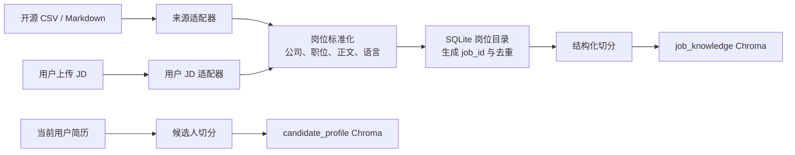
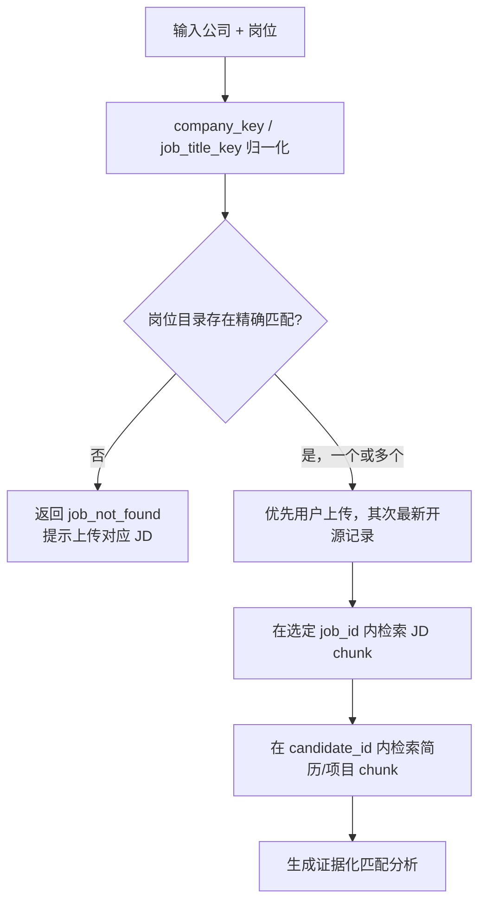

# AI Job Apply Assistant：真实公开语料知识库改造方案

> 状态：可评审方案；本文件只描述改造，不执行代码修改。
> 产品定位：中文优先的个人求职助手。
> 本次目标：以开源项目中的真实公开 JD 作为初始语料，补齐当前大量构造数据造成的真实性不足；当知识库存在用户指定的公司与岗位时，基于该 JD 分析匹配度；未命中时要求用户上传 JD。

---

## 1. 需求澄清与最终范围

### 1.1 本次不做的事

本次**不以岗位溯源、官网验证、岗位仍有效性或自动投递**为目标。系统不得把开源历史 JD 说成“当前正在招聘”，但不需要为每份 JD 建立严格的实时核验流程。

不实施：

- 自动爬取任意招聘网站、绕过访问限制或自动提交申请；
- 对岗位链接进行持续可用性监测；
- 把开源简历当作当前用户的经历；
- 将合成 JD 作为真实公司岗位供匹配功能使用。

### 1.2 本次要实现的能力

1. 将开源项目中已提交的真实公开 JD 导入本项目的岗位知识库。
2. 导入当前项目评测集中的真实公开 JD；排除合成韩语 JD 和中文合成 JD。
3. 用户可以上传一份特定公司的 JD，作为该公司/岗位的补充或优先版本。
4. 匹配请求必须携带公司名和岗位名；系统先按结构化字段定位岗位，再检索该岗位的 chunk 与当前用户简历。
5. 未找到目标公司/岗位时，系统返回 `job_not_found`，提示上传对应 JD；不得使用相似公司或相似岗位代替回答。
6. 将真实公开、用户上传、合成评测三类数据清楚隔离，使展示能说明“答案依据是真实公开数据还是用户上传资料”。

---

## 2. 双层业务知识库

这里的“双层”按业务对象划分，而不是按“实时真实岗位/历史岗位”划分。

| 层级 | collection | 内容 | 用途 | 是否用于匹配 |
|---|---|---|---|---|
| 候选人资料库 | `candidate_profile` | 当前用户上传的简历、项目材料、作品、补充经历 | 给出“我有什么能力”的证据 | 是 |
| 真实公开岗位库 | `job_knowledge` | 开源项目中的真实公开 JD、当前项目真实公开 JD、用户上传 JD | 给出“岗位需要什么”的证据 | 是 |

另有一个不属于业务知识库的隔离区域：

| 区域 | collection | 内容 | 用途 | 线上匹配 |
|---|---|---|---|---|
| 测试与演示区 | `eval_demo` | 合成 JD、合成简历、回归评测样本、多模态 demo | 单测与离线指标 | 永不允许 |

### 2.1 关键原则

1. **候选人数据与岗位数据分开**：当前用户的经历只能来自 `candidate_profile`；公开简历仅用于评测，绝不作为“我”的经历。
2. **结构化定位优先，语义检索随后**：先按公司名和岗位名查 `job_id`，再在该 `job_id` 内做 RAG 检索。
3. **无精确岗位，不做替代推断**：目标 JD 缺失时返回上传引导，不用相似职位凑答案。
4. **真实公开优先，合成数据隔离**：开源真实公开 JD 与用户上传 JD 可入岗位库；构造资料只能存在于测试区。
5. **基础来源标记足够**：保留 `open_source` 或 `user_upload`、来源数据集名、原文件名等基础信息，供 UI 说明；不实施实时溯源系统。
6. **向量库是检索加速器，不是事实源**：原始文件和岗位目录是可重建索引的基础。

---

## 3. 初始真实公开语料

### 3.1 可立即纳入的数据

| 来源 | 数据 | 导入位置 | 导入规则 |
|---|---|---|---|
| `kyosek/RAG-based-job-search-assistant` | `data/jobs.csv`，含公司、职位、地点、LinkedIn 链接与 JD 正文 | `job_knowledge` | 只导入非空公司、职位、描述的记录；标记 `open_source` 与 `kyosek_jobs_csv` |
| 当前 `data/eval_dataset/jds/real_en_jd_*.md` | 5 份真实公开/匿名化英文 JD | `job_knowledge` | 从 Markdown metadata 读取标题、来源与正文；标记 `project_real_en_jd` |
| 当前 `data/jd_docs/*.md` | 用户自行上传或之后由用户确认的 JD | `job_knowledge` | 作为 `user_upload`，同公司同岗位时优先于开源数据 |
| 当前 `data/profile_docs/*.md` | 当前用户简历、项目与补充材料 | `candidate_profile` | 只导入用户确认属于当前候选人的资料 |

### 3.2 明确排除的数据

| 目录/来源 | 原因 | 处理 |
|---|---|---|
| `data/eval_dataset/jds/synth_kr_jd_*` | 明确为合成数据 | 仅保留 `eval_demo` |
| `data/eval_dataset/jds/zh_jd_*` | 由 `tools/generate_zh_eval_dataset.py` 生成，包含虚构公司 | 仅保留 `eval_demo` |
| `data/eval_dataset/resumes/*` | 包含其他候选人的公开或合成简历 | 只可用于评测，不能写入当前用户 profile |
| `data/mm_docs` 中的演示文字/图片 | 目前主要是项目说明、面试稿或测试内容 | 不作为岗位匹配依据 |

### 3.3 关于开源 JD 的展示口径

开源 JD 可以提升“文本内容真实度”和“公司/岗位多样性”，但通常是历史快照。UI 与回答中应使用：

> “基于知识库中的公开历史岗位描述进行分析；岗位当前开放状态请以官方渠道为准。”

这不是岗位实时溯源；它只是避免模型把历史资料误说成正在招聘。

### 3.4 中文优先策略

首批真实公开语料可能以英文 JD 为主。系统仍默认中文回答，但保留原文技术名词；对公司/职位检索使用中英文归一化与别名。中文真实 JD 的主要补充方式是用户上传或手工导入获得许可的公开数据，不能用现有中文合成 JD 冒充真实岗位。

---

## 4. 数据结构与目录设计

### 4.1 最小岗位目录

不需要复杂的溯源数据库，但需要一个轻量岗位目录支持精确查找、去重和用户上传覆盖。使用 Python 标准库 SQLite：`data/job_catalog.sqlite3`。

```sql
CREATE TABLE job_records (
  job_id TEXT PRIMARY KEY,
  company_name TEXT NOT NULL,
  company_key TEXT NOT NULL,
  job_title TEXT NOT NULL,
  job_title_key TEXT NOT NULL,
  location TEXT,
  language TEXT NOT NULL,
  source_kind TEXT NOT NULL,
  source_dataset TEXT NOT NULL,
  source_file TEXT NOT NULL,
  source_url TEXT,
  content_hash TEXT NOT NULL,
  is_user_uploaded INTEGER NOT NULL DEFAULT 0,
  created_at TEXT NOT NULL,
  UNIQUE(company_key, job_title_key, content_hash)
);

CREATE INDEX idx_job_lookup
ON job_records(company_key, job_title_key, is_user_uploaded);
```

字段含义：

- `company_key`：小写、去空格/常见公司后缀后的公司名，用于精确定位。
- `job_title_key`：小写、合并中英文空格/连字符后的岗位名，用于精确定位。
- `source_kind`：`open_source` 或 `user_upload`。
- `source_dataset`：如 `kyosek_jobs_csv`、`project_real_en_jd`、`manual_upload`。
- `is_user_uploaded`：同公司同岗位存在多份时，用户上传版本优先。

不保存、也不需要保存岗位实时状态、最后核验日期、官网快照版本、授权审批状态等上版方案中的重型治理字段。

### 4.2 原始文件与向量库目录

```text
data/
  source_corpus/
    open_source_jobs/
      kyosek_jobs.csv
      project_real_en_jds/
    user_jobs/{job_id}/job.md
    candidate_profiles/{candidate_id}/...
    eval_demo/...                         # 仅测试
  job_catalog.sqlite3
  vector_db/
    candidate_profile/
    job_knowledge/
    eval_demo/
```

`source_corpus/open_source_jobs` 保存导入的原始文件副本，便于重建；`job_knowledge` 只保存派生的 chunk/embedding。

### 4.3 每个 JD chunk 的 metadata

```python
JOB_CHUNK_METADATA = {
    "chunk_id": "job:{job_id}:{chunk_index}",
    "collection": "job_knowledge",
    "scope": "job",
    "job_id": "...",
    "company_name": "...",
    "company_key": "...",
    "job_title": "...",
    "job_title_key": "...",
    "source_kind": "open_source | user_upload",
    "source_dataset": "...",
    "source_file": "...",
    "language": "zh | en",
    "section": "requirements | responsibilities | ...",
    "chunk_index": 0,
}
```

候选人资料 chunk 只使用：

```python
PROFILE_CHUNK_METADATA = {
    "collection": "candidate_profile",
    "scope": "profile",
    "candidate_id": "...",
    "source_kind": "user_upload",
    "source_file": "...",
    "section": "skills | project_experience | ...",
    "chunk_index": 0,
}
```

---

## 5. 导入与索引流程



### 5.1 适配器

新增两类适配器，统一输出 `NormalizedJob`：

```python
@dataclass
class NormalizedJob:
    company_name: str
    job_title: str
    description: str
    location: str | None
    source_kind: Literal["open_source", "user_upload"]
    source_dataset: str
    source_file: str
    source_url: str | None
    language: Literal["zh", "en"]
```

1. `KyosekCsvAdapter`：读取 `Job_ID, Location, Title, Company, Link, Description`；`Job_ID` 写入外部标识但不取代本项目 `job_id`。
2. `ProjectMarkdownAdapter`：解析 `real_en_jd_*.md` 中的 `Metadata` 与 `Content`。
3. `UserUploadAdapter`：沿用 `load_one_file`，由前端显式提供公司名与岗位名；不尝试从任意文件名猜测。

### 5.2 去重与优先级

1. 对 `company_key + job_title_key + description` 计算 SHA-256。
2. 同一内容 hash 已导入时跳过，不新增 Chroma chunk。
3. 同公司同岗位但正文不同，保留多个 `job_id` 记录；查询结果按 `is_user_uploaded DESC, created_at DESC` 排序。
4. 用户上传 JD 覆盖开源数据的含义是“优先用于分析”，不是删除开源历史记录。

### 5.3 embedding 与 rerank

- 默认 `HashEmbeddings` 只保留为离线兜底；真实岗位匹配默认改用中英多语 embedding，例如 BGE-M3 或同等可本地部署模型。
- 为避免维度错配，每个 collection 将 embedding backend、模型名、维度保存至 `collection_manifest.json`。
- 使用重排前必须确认本地模型文件存在；不可用时返回 `rerank_applied=false`，保持向量排序，不使用把中文整句当作一个 token 的伪词法重排。

---

## 6. 关键交互：公司 + 岗位匹配

### 6.1 前端输入

匹配工作台不再只接受自由问题。要求用户显式填写或选择：

```text
candidate_id：当前候选人
company_name：目标公司
job_title：目标岗位
question：可选补充问题，例如“我的主要差距是什么？”
```

### 6.2 查询决策



### 6.3 不命中的固定响应

```json
{
  "status": "job_not_found",
  "company_name": "用户输入的公司",
  "job_title": "用户输入的岗位",
  "message": "知识库中没有该公司与岗位的岗位描述。请上传或粘贴对应 JD 后再进行匹配分析。",
  "upload_action": "/api/jobs/upload"
}
```

该情形**不能**：

- 用同公司其他岗位代替；
- 用其他公司的同名岗位代替；
- 从语义最相近的职位生成“匹配结论”；
- 调用合成评测 JD 填补空缺。

### 6.4 命中后的回答格式

```text
结论：匹配度：中等 / 高 / 待补充资料。

已匹配证据：
- [候选人项目：企业知识库 RAG] ...
- [岗位要求：AI 应用工程师] ...

主要缺口：
- [岗位要求] ...；当前简历中没有明确证据。

建议：
1. ...

资料说明：本次依据为知识库中的公开历史 JD / 用户上传 JD；岗位实时状态请自行确认。
```

结论不使用无依据的百分比分数。若展示分数，必须由显式的“已满足/未满足/未知”字段计算，并可展开查看证据。

---

## 7. 对当前项目的修改方案

### 7.1 新增模块

```text
app/knowledge/
  __init__.py
  models.py          # NormalizedJob、JobLookup、导入/匹配响应
  catalog.py         # SQLite 建表、查询、去重
  normalize.py       # 公司/岗位名归一化、语言检测
  importers.py       # KyosekCsvAdapter、ProjectMarkdownAdapter、UserUploadAdapter
  ingestion.py       # 文件落盘、分块、稳定 ID、Chroma 写入
  retrieval.py       # job_id/candidate_id 受控检索
  health.py          # collection manifest、embedding/reranker 健康检查

app/routes/knowledge.py
tools/import_open_source_jobs.py
tools/rebuild_job_knowledge.py
```

### 7.2 修改现有模块

| 文件 | 修改内容 |
|---|---|
| `app/config.py` | 增加 `job_catalog_path`、`source_corpus_dir`、`job_collection_name`、embedding manifest 配置 |
| `app/rag.py` | 保留加载和 `split_documents_semantic`；移除业务路径直接 `add_documents` 的使用 |
| `app/services/application_service.py` | 匹配前调用 `JobCatalog.lookup(company_name, job_title)`；未命中直接返回上传引导 |
| `app/schemas.py` | `FitRequest` 增加 `candidate_id`、`company_name`、`job_title`；增加 `JobNotFoundResponse` |
| `app/agent/tools.py` | `retrieve_job` 改为必须传公司、岗位或 `job_id`，不允许全库自由检索用于投递分析 |
| `app/multimodal/service.py` | 将评测入库改为临时 `eval_demo` collection；普通图片/文本需声明 `candidate_id` 或 `job_id` |
| `app/multimodal/reranker.py` | reranker 不可用时 `applied=False`，附带降级原因 |
| `streamlit_app.py` | 新增“岗位库管理”“匹配工作台”“上传 JD 引导”“索引健康”；评测页明确隔离 |
| `tools/rebuild_zh_text_kb.py` | 逐步替换为 `rebuild_job_knowledge.py`，基于 SQLite catalog 重建岗位索引 |

---

## 8. API 设计

| 方法 | 路径 | 用途 |
|---|---|---|
| `POST` | `/api/jobs/import/open-source` | 管理员导入本地保存的 CSV/Markdown 开源语料 |
| `POST` | `/api/jobs/upload` | 用户上传特定公司/岗位 JD |
| `GET` | `/api/jobs/search` | 根据公司名和岗位名返回精确命中候选，供 UI 选择 |
| `GET` | `/api/jobs/{job_id}` | 查看岗位正文、来源标签和 chunk 信息 |
| `POST` | `/api/jobs/rebuild` | 根据目录账本重建 `job_knowledge` |
| `POST` | `/api/fit` | 基于 `candidate_id + company_name + job_title` 匹配 |
| `GET` | `/api/knowledge/health` | 检查 collection、模型维度、chunk 数与 reranker |

### 8.1 匹配接口约束

```python
class FitRequest(BaseModel):
    candidate_id: str
    company_name: str
    job_title: str
    question: str = "请分析我的匹配度、主要证据与能力缺口。"
```

如果只有 `jd_text` 而没有公司/岗位，则先在服务端创建 `user_upload` 记录，再用该新建 `job_id` 进行分析。这样临时粘贴 JD 仍然走统一索引路径。

---

## 9. Streamlit 展示改造

### 9.1 岗位库管理页

- 展示已导入真实公开 JD 数、公司数、岗位类别、语言分布、来源数据集。
- 提供“导入开源语料”按钮，仅支持本地受控文件路径和预定义适配器。
- 提供“上传我的目标 JD”表单：公司名、岗位名、文件/文本。
- 每条岗位显示 `公开历史数据` 或 `用户上传` 标签，不显示“实时有效”。

### 9.2 匹配工作台

- 下拉选择当前候选人；填写公司与岗位。
- 先显示“是否找到精确 JD”；找到时显示对应记录，允许用户确认选择。
- 未找到时只显示上传入口和说明，不显示泛化匹配结果。
- 找到后分栏展示“岗位要求证据”“候选人经历证据”“匹配项/缺口/建议”。

### 9.3 评测与展示隔离

- 原有 RAG 评测页保留，但标题改为“隔离评测报告”。
- 合成中文样本仅用于展示结构化切分和多模态能力。
- 真实公开 JD 演示使用导入后的 `job_knowledge`，UI 显示来源数据集。

### 9.4 建议演示脚本

1. 导入 kyosek 的真实公开 JD 与项目中的真实英文 JD。
2. 上传当前候选人的真实简历。
3. 输入库中已有的公司和岗位，展示精确命中、RAG 证据和匹配分析。
4. 输入一个不存在的公司/岗位，展示系统不猜测，而是引导上传 JD。
5. 上传该 JD 后立即重试，展示新岗位被索引并可完成分析。
6. 打开评测页，说明合成数据在隔离 collection 中，不能影响真实匹配。

---

## 10. 实施计划

### 阶段 0：清理数据边界与建立基线

**文件**：修改 `app/config.py`、`app/multimodal/service.py`；新建 `tests/test_eval_isolation.py`。

- [ ] 写失败测试：普通聊天或匹配服务不能读取 `eval_demo` collection。
- [ ] 修改评测入库逻辑，使其写入 `eval_run_{uuid}` 或 `eval_demo`，不再写生产多模态库。
- [ ] 运行 `python -m unittest discover -s tests -v`；确认现有测试通过。

**验收**：评测前后，岗位库和候选人资料库 chunk 数不变。

### 阶段 1：岗位目录与归一化

**文件**：新建 `app/knowledge/models.py`、`app/knowledge/catalog.py`、`app/knowledge/normalize.py`；新建 `tests/test_job_catalog.py`。

- [ ] 写失败测试：`normalize_company_name("Bird & Bird LLP")` 和标准名称生成一致 key。
- [ ] 写失败测试：同一公司、岗位、正文重复导入只保留一个 `job_id`。
- [ ] 实现 SQLite schema、SHA-256 去重与公司/岗位 key 归一化。
- [ ] 运行 `python -m unittest tests.test_job_catalog -v`。

**验收**：可按 `company_name + job_title` 精确查询岗位记录。

### 阶段 2：导入开源真实 JD

**文件**：新建 `app/knowledge/importers.py`、`app/knowledge/ingestion.py`、`tools/import_open_source_jobs.py`；新建 `tests/test_open_source_import.py`。

- [ ] 写失败测试：kyosek CSV 空公司/空职位/空描述行被跳过并出现在导入报告。
- [ ] 写失败测试：`real_en_jd_*.md` 解析后带 `source_kind=open_source`。
- [ ] 实现 CSV 与 Markdown 适配器，将合格记录写入 `source_corpus/open_source_jobs`、catalog 和 `job_knowledge`。
- [ ] 运行 `python -m unittest tests.test_open_source_import -v`。

**验收**：导入报告给出成功、跳过、重复三类数量，所有 chunk 包含 `job_id/company_key/job_title_key`。

### 阶段 3：用户 JD 上传与优先级

**文件**：新建 `app/routes/knowledge.py`；修改 `app/main.py`、`app/rag.py`；新建 `tests/test_user_job_upload.py`。

- [ ] 写失败测试：未提供公司名或岗位名的用户 JD 请求返回 422。
- [ ] 写失败测试：同公司同岗位的用户上传 JD 在查询结果中排在开源 JD 前。
- [ ] 实现上传/粘贴接口、原文落盘、目录登记、结构化切分和稳定 chunk ID。
- [ ] 运行 `python -m unittest tests.test_user_job_upload -v`。

**验收**：用户上传目标 JD 后，可立即在 `/api/jobs/search` 中被精确查到。

### 阶段 4：精确匹配路由与无命中引导

**文件**：新建 `app/knowledge/retrieval.py`；修改 `app/services/application_service.py`、`app/schemas.py`、`app/agent/tools.py`；新建 `tests/test_job_scoped_fit.py`。

- [ ] 写失败测试：公司/岗位未命中时，`/api/fit` 返回 `job_not_found`，不会调用 LLM。
- [ ] 写失败测试：指定 A 公司岗位时，检索结果不包含 B 公司或其他岗位 chunk。
- [ ] 写失败测试：匹配结果同时包含候选人证据和 JD 证据。
- [ ] 实现 `JobCatalog.lookup`、按 `job_id` 过滤的检索、优先级选择与固定无命中响应。
- [ ] 运行 `python -m unittest tests.test_job_scoped_fit -v`。

**验收**：不存在目标岗位时，界面只显示“上传 JD 后分析”；命中后才生成匹配结论。

### 阶段 5：模型/索引健康与多语检索

**文件**：新建 `app/knowledge/health.py`、`tools/rebuild_job_knowledge.py`；修改 `app/config.py`、`app/multimodal/reranker.py`；新建 `tests/test_job_index_health.py`。

- [ ] 写失败测试：embedding 模型维度与 manifest 不一致时拒绝查询并提示重建。
- [ ] 写失败测试：reranker 模型文件不存在时 `rerank_applied` 为 `false`。
- [ ] 实现 collection manifest、健康检查和从 `source_corpus + job_catalog` 重建索引的工具。
- [ ] 把默认真实岗位 embedding 切换为已准备好的中英多语模型后重建 `job_knowledge`。
- [ ] 运行 `python -m unittest tests.test_job_index_health -v`。

**验收**：当前环境的索引目录、模型路径和维度不一致时，不再静默返回无效结果。

### 阶段 6：Streamlit 与文档

**文件**：修改 `streamlit_app.py`、`README.md`；新建 `docs/knowledge-base-operation.md`。

- [ ] 新增岗位库管理、目标 JD 上传、精确岗位选择和无命中上传引导页面。
- [ ] 在结果中展示来源标签、公司、岗位、候选人证据和 JD 证据。
- [ ] 在评测页展示隔离说明和 collection 名称。
- [ ] 运行 `python -m unittest discover -s tests -v`。

**验收**：可完整演示“开源真实 JD 导入 → 精确命中分析 → 不命中上传 → 新 JD 生效”的流程。

---

## 11. 验收清单

1. `job_knowledge` 中不存在 `synthetic_eval` 或 `synth_*` 来源。
2. 当前用户 profile 中不存在公开/合成其他候选人简历。
3. 导入后能按至少一个真实公司和岗位精确命中，并给出 JD 原文证据。
4. 查询不存在的公司/岗位时，不输出匹配分数和泛化分析，只返回上传引导。
5. 用户上传 JD 后，同一请求可精确命中用户上传版本。
6. 历史公开 JD 的结果带“公开历史岗位描述”说明，不暗示岗位仍有效。
7. 评测数据不会出现在匹配、材料生成和面试准备的引用中。
8. embedding 维度不一致、路径失效或 reranker 缺失时，健康页给出明确错误或降级状态。

---

## 12. 最终展示价值

改造后，项目的展示主线是：

```text
真实公开 JD / 用户上传 JD
  → 公司与岗位标准化、目录化与去重
  → 基于目标公司 + 岗位的精确定位
  → 在该 JD 内检索岗位要求
  → 在当前用户资料内检索经历证据
  → 输出有证据的匹配项、缺口与下一步建议
  → 未命中时不猜测，提示上传对应 JD
```

这比“使用构造 JD 得到漂亮匹配结果”的展示更可信：系统既能使用真实公开岗位语料，也能明确知道自己何时没有足够资料，进而把用户引导回补充真实 JD 的正确路径。
